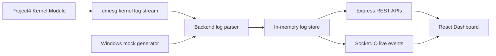
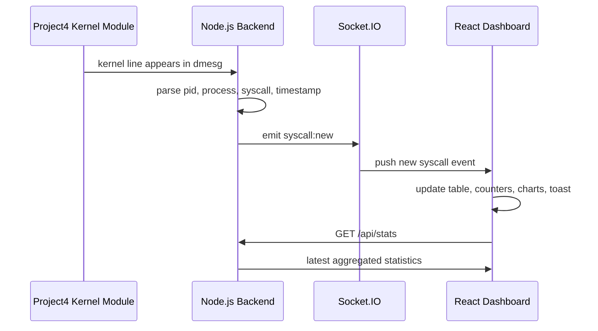

# Cross-Platform Linux System Call Monitoring Dashboard

A complete frontend and backend dashboard around the existing Project4 Linux
kernel module. The kernel module stays unchanged. The Node.js backend reads
kernel logs on Linux and automatically switches to a mock syscall generator on
Windows so the demo works everywhere.

## Folder Structure

```text
project-root/
├── kernel_module/        # Existing Project4 kernel module goes here unchanged
├── backend/              # Express + Socket.IO backend
├── frontend/             # Vite + React + Tailwind dashboard
└── README.md
```

## Run The Project

Backend:

```bash
cd backend
npm install
cp .env.example .env
npm run dev
```

Frontend:

```bash
cd frontend
npm install
cp .env.example .env
npm run dev
```

Open `http://localhost:5173`.

## Linux Kernel Module Setup

Place the existing Project4 module files in `kernel_module/`, then build and
load them exactly as your original project requires. This dashboard does not
change the kernel module logic.

Typical Linux flow:

```bash
cd kernel_module
make
sudo insmod project4.ko
dmesg --follow
```

Then run the backend. On Linux, it uses:

```bash
dmesg --follow --human
```

If your system restricts `dmesg`, run the backend with suitable permissions or
disable `kernel.dmesg_restrict` for the demo environment.

## Windows Demo Mode

On Windows, the backend automatically starts in mock mode and generates syscall
logs every few seconds. This lets the full dashboard run for college
presentations without Linux kernel support.

To force mock mode on Linux:

```bash
FORCE_MOCK=true npm run dev
```

On PowerShell:

```powershell
$env:FORCE_MOCK="true"; npm run dev
```

## Backend APIs

- `GET /api/logs` returns parsed syscall log entries.
- `GET /api/stats` returns dashboard statistics.
- `GET /health` returns runtime and monitor status.

Log shape:

```json
{
  "pid": 1234,
  "process": "bash",
  "syscall": "openat",
  "timestamp": "2026-05-23T10:00:00.000Z"
}
```

Socket.IO events:

- `syscall:new`
- `logs:init`
- `stats:update`
- `monitor:status`
- `monitor:error`
- `monitor:pause`
- `monitor:resume`

## Architecture

The backend detects the OS at startup. Linux uses the `dmesg` reader, while
Windows and other platforms use the mock generator. Both paths produce the same
JSON log format, so the frontend does not need platform-specific code.



## Live Sequence



## Dashboard Features

- Live syscall log table
- Search by process name
- Filter by syscall type
- Pause and resume monitoring
- Export filtered logs to CSV
- Real-time notification popup
- Activity counters
- Bar chart, pie chart, and line graph with Recharts
- Status indicator for Linux Monitoring Active or Windows Demo Mode
- Theme toggle
- Responsive layout

## Sample Screenshots Description

- Dashboard: dark terminal-inspired header, glowing system status card, animated
  syscall counters, live charts, and recent kernel log table.
- Live Monitor: large real-time table with search, syscall filter, pause/resume,
  and CSV download controls.
- Statistics: full-width chart view showing top processes, syscall mix, and
  syscall activity per minute.
- About Project: concise architecture summary explaining Linux integration and
  Windows mock mode.

## Notes For Beginners

- The frontend reads `VITE_API_URL` from `frontend/.env`.
- The backend reads `PORT`, `FRONTEND_URL`, `MAX_LOGS`, `MOCK_INTERVAL_MS`, and
  `FORCE_MOCK` from `backend/.env`.
- The parser is intentionally tolerant because student kernel module log formats
  often differ. It looks for common patterns such as `pid=`, `process=`, and
  `syscall=`.

